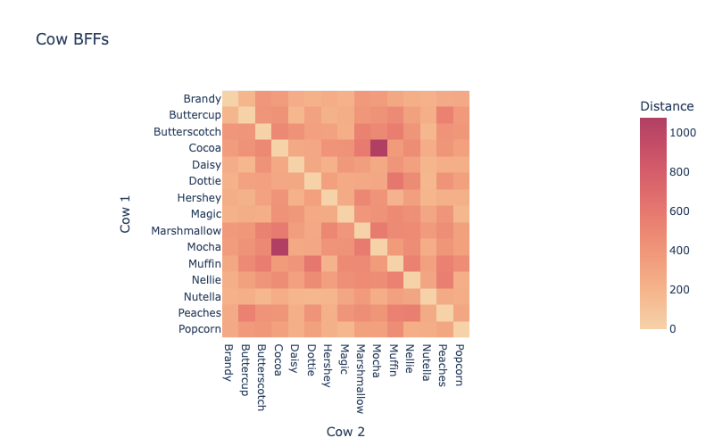

# Cow BBF Project

This is a sample data engineering project that tries to answer the question if cow best friends also take their meals together. 



This project has been used for the talk "[Bridging the Production Gap: Develop and Deploy Code Easily With IDEs](https://www.databricks.com/dataaisummit/session/bridging-production-gap-develop-and-deploy-code-easily-ides/)" as the DATA+AI Summit 2023.

[](https://www.youtube.com/watch?v=-mtwFb9Dyy0)

## Preparing the sample Data

The notebook `/notebooks/Generate Cow Data.ipynb` contains the code to generate the sample data. In order to create the sample data import this notebook into your Databricks workspace and execute it there.

Alternatively you can open the notebook in VS Code with the Databricks extension installed and execute the `Databricks: Run File as Workflow on Databricks` command.

## Setup Virtual Environment

Configure Python virtual environment

```sh
python3.10 -m venv .venv
source .venv/bin/activate
pip install -r requirements.txt
```

## Running unit tests

```sh
pytest -v tests --disable-warnings
```